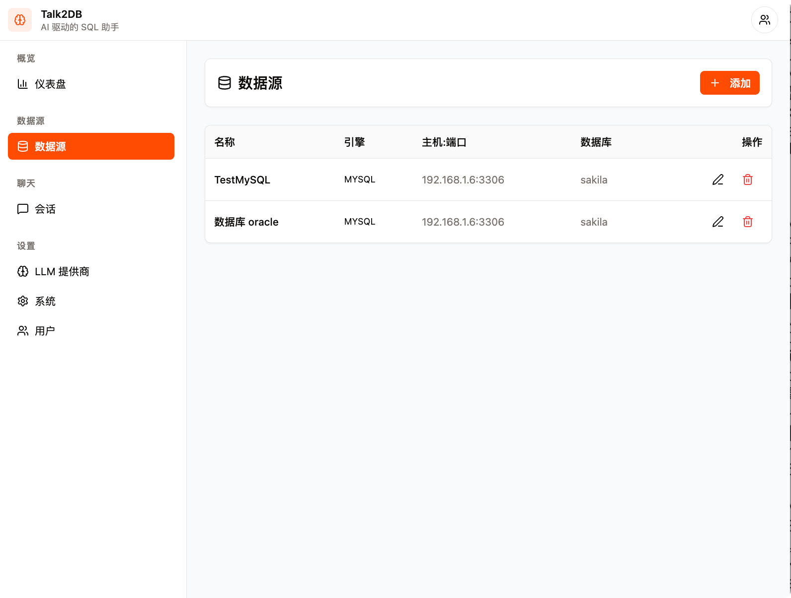
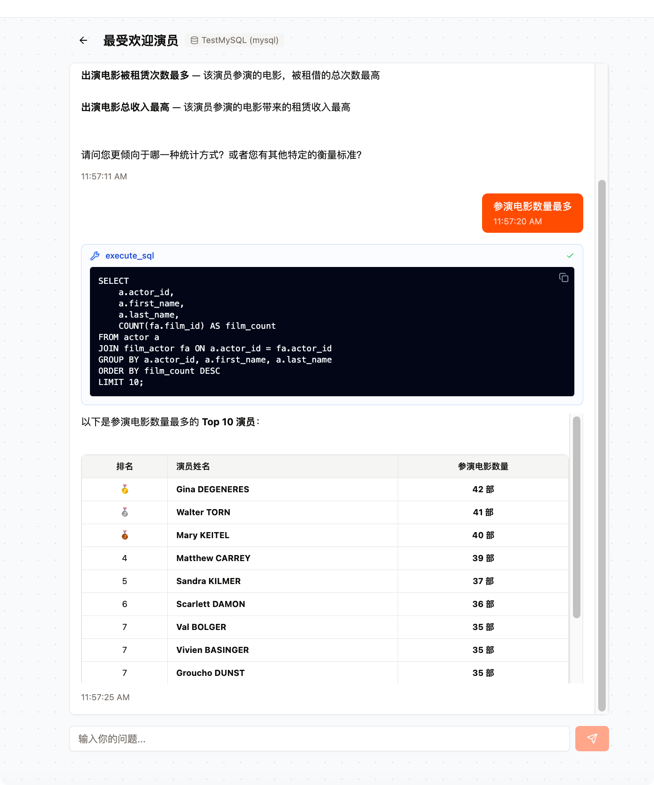
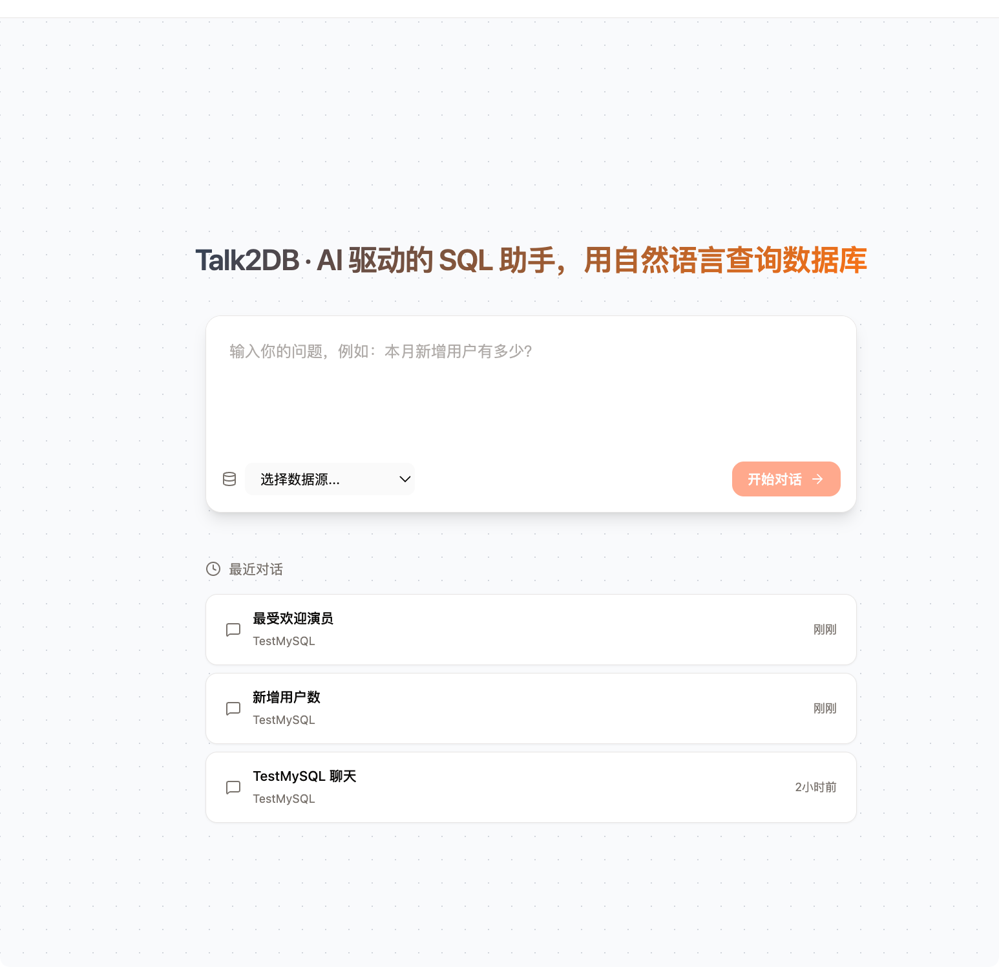

# Talk2DB

AI-powered SQL assistant. Connect your databases, select tables, then chat in natural language — the LLM agent converts your questions to SELECT queries and executes them.



## Features

- **Multi-database support** — MySQL, PostgreSQL, Oracle
- **Natural language to SQL** — ask questions in plain English, get answers from your data
- **ReAct agent** — the LLM thinks, writes SQL, executes, and interprets results in a loop
- **Streaming responses** — see the agent's thought process in real time via SSE
- **Table spaces** — group relevant tables together for focused conversations
- **Multi-tenant** — user management with session-based auth



## Quick Start

```bash
make build-web     # Build React frontend
make build         # Build binary with embedded frontend
./bin/talk2db      # Start the server (default :8080)
```

Default login: `admin` / `admin`

For frontend development, run the Vite dev server separately:

```bash
cd web && npm run dev
```



## Configuration

| Variable | Default | Description |
|---|---|---|
| `ADMIN_ADDR` | `:8080` | Admin server listen address |
| `DB_DRIVER` | `sqlite` | App DB driver (`sqlite` or `pgx`) |
| `DB_DSN` | `var/db/app.sqlite` | App DB connection string |
| `DATABASE_URL` | — | Overrides DB driver to `pgx` and sets DSN |
| `SESSION_SECRET` | `change-me-to-a-random-secret` | Cookie session encryption key |

## Architecture

```
cmd/talk2db/main.go          — bootstrap: opens DB, creates registry, starts Gin server
internal/
  config/config.go           — env-based config
  db/db.go                   — GORM Store: auto-migrate models, CRUD
  models/                    — GORM models
  admin/                     — Gin HTTP handlers + cookie-session auth
  datasource/                — connection pool registry + engine drivers
  agent/                     — ReAct agent factory, chat model, SQL tool
web/                         — React + TypeScript frontend (Vite, Tailwind, Radix UI)
```

## Build

```bash
make build-web     # Build React frontend (web/dist)
make build         # Build full binary with embedded frontend → bin/talk2db
make dev           # Run with !embed build tag (serve webui/dist from disk)
make test          # go test ./...
make vet           # go vet ./...
```

The `embed` build tag controls whether the React SPA is embedded in the Go binary or served from disk.

## License

MIT
